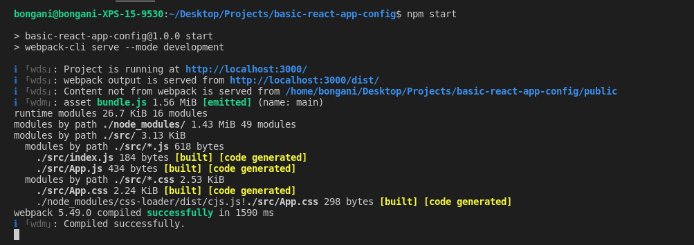
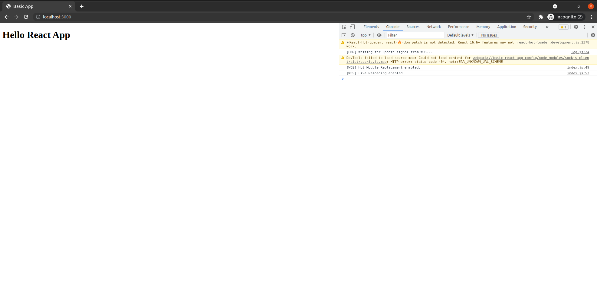

# basic-react-app-config
This serves as a guide to creating a barebones React.js app without boilerplate code.

## Dependency packages used
- webpack
- babel
- react-Hot-Loader

## Guide to creating an app without boilerplate code
File | Purpose
-----| -------
index.html | renders the view to the client
ES6 Support | modern JS syntax. This is done through Babel compiler
Webpack | build apps, css modules for styling and serve the app during development
Root Component | root component that holds all the other components ```(<div id="root"></div>)```. Root component is defined in **index.html**

## Basic React Structure
```tree
    ├── .babelrc
    ├── node_modules
    ├── package.json
    ├── package-lock.json
    ├── public
    │   └── index.html
    ├── README.md
    ├── src
    │   ├── App.css
    │   ├── App.js
    │   └── index.js
    └── webpack.config.js
```

## Create base folders and files
Start by creating the npm package.json file in the root folder
```
   npm init -y
```

The base folders and files are;
* public
```
   mkdir public
```
* src
```
   mkdir src
``` 
* index.html 
```
   touch public/index.html
```
* index.js
```
   touch src/index.js
```
* .babelrc
```
   touch .babelrc
```

## Install the required packages
Package Dependencies | Command Line Argument
-------------------- | ---------------------
Babel                | npm install --save-dev @babel/core @babel/cli @babel/preset-env @babel/preset-react
React and ReactDOM   | npm install react react-dom
Webpack              | npm install --save-dev webpack webpack-cli webpack-dev-server style-loader css-loader babel-loader
React-Hot-Loader     | npm install --save-dev react-hot-loader

### Setup files and content

## Index.html
```html
    <!DOCTYPE html>
    <html lang="en">
    <head>
        <meta charset="UTF-8">
        <meta http-equiv="X-UA-Compatible" content="IE=edge">
        <meta name="viewport" content="width=device-width, initial-scale=1.0,   shrink-to-fit=no">
        <title>Basic App</title>
    </head>
    <body>
        <div id="root"></div>
        <noscript>
            Please enable JavaScript to view the site
        </noscript>
        <script src="../dist/bundle.js"></script>
    </body>
    </html>
```
The ```<div>``` component with the id selector **root** will serve as the Root component.
```<script src="../dist/bundle.js"></script>``` is for the bundle.js file that is built using webpack.

## index.js
```javascript
    import React from 'react';
    import ReactDOM from 'react-dom';
    import App from './App.js';

    ReactDOM.render(<App />, document.getElementById('root'));
```
- index.js loads the App component into the Root component

## App.js
```javascript
    import React from 'react';
    import { hot } from 'react-hot-loader';
    import './App.css';

    const App = () => (
        <div className="App">
            <h1>Hello React App</h1>
        </div>
    );

    // default statement when exporting module without hot-loader
    // export default App;

    // when you are using the react-hot-loader dependency, otherwise comment out this line
    export default hot(module)(App);
```
- App.js is using JSX.
- Hot Loader is used reload the server when changes are saved.

## App.css
```css
    .App{
        font-family: Arial, Helvetica, sans-serif;
        line-height: 1;
        color: #222;
    }
```
Basic styling for the App component

## Configure Babel and Webpack for deployment

In the file .babelrc, insert the following config;

```javascript
    {
        "presets":["@babel/preset-env","@babel/preset-react"]
    }
```
Create a webpack.config.js file and add the following configuration;
```
    touch webpack.config.js
```
```javascript
    const path = require('path');
    const webpack = require('webpack');

    module.exports = {
        entry: './src/index.js',
        mode: 'development',
        module: {
            rules: [
                {
                    test: /\.(js|jsx)$/,
                    exclude: path.resolve(__dirname, 'node_modules/'),
                    loader: 'babel-loader',
                    options: { presets: ["@babel/env"] }
                },
                {
                    test: /\.css$/,
                    use: ["style-loader","css-loader"]
                }
            ]
        },
        resolve: { extensions: ['*','.js','.jsx'] },
        output: {
            path: path.resolve(__dirname, 'dist'),
            publicPath: '/dist/',
            filename: 'bundle.js'
        },
        devServer: {
            contentBase: path.join(__dirname, '/public'),
            port: 3000,
            publicPath: 'http://localhost:3000/dist/',
            hotOnly: true
        },
        plugins: [new webpack.HotModuleReplacementPlugin()]
    };
```
- The test rules in the module object i.e ```test: /\.(js|jsx)$/,``` and ```test: /\.css$/``` are using regex to target javascript, react jsx and css files for the components

## Final Steps

To deploy and serve the app, add the following attributes to the **package.json** file.
```javascript
    "scripts": {
        "start": "webpack-cli serve --mode development",
        "build": "webpack --mode development"
    }
```
- Serve the app by running ```npm start``` in the terminal.
- Build the app using webpack to get ```bundle.js``` to get the ```/dist/bundle.js``` in the root folder.
- When you are running webpack and hot-loader, the dist folder is built and purged from memory. You can only see the folder only when you build using webpack.

## Misc
If your **package.json** file is not updated by the time you reach the end of this documentation, just execute the command below to update the file
```
    npm init -y
```

## Visual Output
- Server the app via terminal

- View the app in a browser


## Enviroment setup
- Ubuntu 20+
- Visual Studio Code
- npm -version 7.20.5 

PS - Do not forget to add **node_modules** to **.gitignore**.
